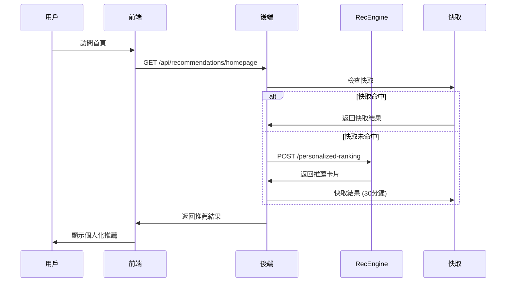
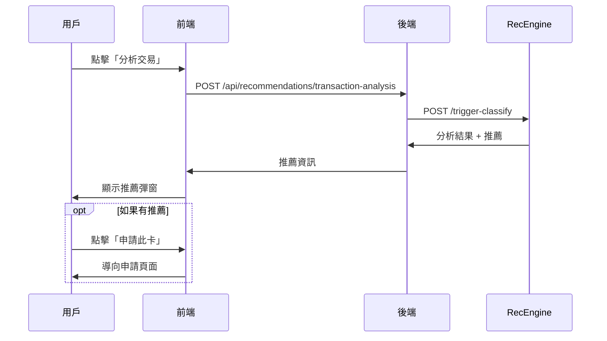

# RecEngine Integration Guide

RecEngine 已完全整合到 CrediBot 系統中，提供強大的 ML 驅動信用卡推薦功能。

## 🎯 整合完成度

### ✅ 已完成功能

1. **RecEngine ML 服務** - 12張信用卡，7個API端點
2. **後端整合層** - TypeScript 服務封裝，快取，錯誤處理  
3. **前端 React 組件** - 首頁輪播，交易分析彈窗
4. **Docker 容器化** - 完整 microservices 架構
5. **整合測試** - 自動化測試腳本，性能驗證

## 🚀 快速啟動

### 方法一：使用 Docker Compose (推薦)

```bash
# 啟動完整系統
docker-compose -f docker-compose.recengine.yml up -d

# 檢查服務狀態
docker-compose -f docker-compose.recengine.yml ps

# 查看日誌
docker-compose -f docker-compose.recengine.yml logs -f
```

### 方法二：分別啟動服務

```bash
# 1. 啟動 RecEngine
cd recengine
python src/api.py

# 2. 啟動後端 (另一終端)
cd backend
npm run dev

# 3. 啟動前端 (另一終端)  
cd frontend
npm start
```

## 🔗 服務架構

```
Frontend (React) ←→ Backend (Node.js) ←→ RecEngine (Python)
     ↓                    ↓                    ↓
   Port 3000           Port 3001           Port 8000
```

### 服務端點對應

| 功能 | 前端調用 | 後端路由 | RecEngine端點 |
|------|----------|----------|---------------|
| 首頁推薦 | `GET /api/recommendations/homepage` | `→ RecEngine` | `/personalized-ranking` |
| 交易分析 | `POST /api/recommendations/transaction-analysis` | `→ RecEngine` | `/trigger-classify` |
| 回饋估算 | `POST /api/recommendations/estimate-rewards/:cardId` | `→ RecEngine` | `/estimate-rewards` |
| 投資組合優化 | `GET /api/recommendations/optimization` | `→ RecEngine` | `/optimize-portfolio` |

## 📱 前端使用方式

### 1. 首頁個人化推薦

```typescript
import { HomepageCarousel } from './components/RecEngine/HomepageCarousel';

function HomePage() {
  return (
    <div>
      <HomepageCarousel />
      {/* 其他首頁內容 */}
    </div>
  );
}
```

### 2. 交易分析彈窗

```typescript
import { TransactionRecommendation } from './components/RecEngine/TransactionRecommendation';

function TransactionList() {
  const [analysisOpen, setAnalysisOpen] = useState(false);
  const [selectedTransaction, setSelectedTransaction] = useState(null);

  const handleAnalyze = (transaction) => {
    setSelectedTransaction(transaction);
    setAnalysisOpen(true);
  };

  return (
    <div>
      {transactions.map(txn => (
        <div key={txn.id}>
          {/* 交易資訊 */}
          <button onClick={() => handleAnalyze(txn)}>
            分析更好選擇
          </button>
        </div>
      ))}
      
      <TransactionRecommendation
        transaction={selectedTransaction}
        open={analysisOpen}
        onClose={() => setAnalysisOpen(false)}
        onApplyCard={(cardId) => window.location.href = `/cards/${cardId}`}
      />
    </div>
  );
}
```

### 3. 使用 Custom Hook

```typescript
import { useRecEngine } from '../hooks/useRecEngine';

function Dashboard() {
  const { usePortfolioOptimization, compareCards } = useRecEngine();
  const { data: optimization, isLoading } = usePortfolioOptimization();

  const handleCompareCards = async () => {
    const result = await compareCards.mutateAsync({
      card_ids: ['chase_sapphire_preferred', 'american_express_gold_card'],
      spending_pattern: userSpending
    });
    console.log('Best card:', result.best_card);
  };

  return (
    <div>
      {/* 組合優化建議 */}
      {optimization?.recommendations.map(rec => (
        <div key={rec.card_id}>
          <strong>{rec.action.toUpperCase()}</strong>: {rec.card_name}
          <p>{rec.reasoning}</p>
        </div>
      ))}
    </div>
  );
}
```

## 🔧 後端整合方式

### 1. 在現有路由中使用

```typescript
import { RecEngineService } from '../services/recengine/RecEngineService';

const recEngine = new RecEngineService();

// 在交易處理後自動分析
export async function processTransaction(transaction) {
  // 儲存交易
  await saveTransaction(transaction);
  
  // 背景分析推薦 (非阻塞)
  setTimeout(async () => {
    try {
      const analysis = await recEngine.classifyTrigger({
        user_id: transaction.user_id,
        amount: transaction.amount,
        category: transaction.category,
        current_card_id: transaction.card_id
      });
      
      if (analysis.recommend_flag) {
        await sendPushNotification(transaction.user_id, {
          title: '更好的信用卡推薦',
          body: `使用 ${analysis.suggested_card_id} 可多賺 $${analysis.extra_reward}`
        });
      }
    } catch (error) {
      console.error('推薦分析失敗:', error);
    }
  }, 0);
}
```

### 2. 新增自定義端點

```typescript
// routes/my-recommendations.ts
router.get('/my-cards/optimization', async (req, res) => {
  const userId = req.user.id;
  const userCards = await getUserCards(userId);
  const spendingPattern = await getSpendingPattern(userId);
  
  const optimization = await recEngine.optimizePortfolio({
    user_id: userId,
    current_cards: userCards,
    spending_pattern: spendingPattern
  });
  
  res.json({ optimization });
});
```

## 🧪 測試與驗證

### 執行整合測試

```bash
# 執行完整測試套件
./integration-test.sh

# 測試特定功能
curl -X POST http://localhost:8000/trigger-classify \
  -H "Content-Type: application/json" \
  -d '{
    "user_id": "test_user",
    "amount": 150.0,
    "category": "dining",
    "current_card_id": "citi_double_cash_card"
  }'
```

### 監控與除錯

```bash
# 查看 RecEngine 日誌
docker logs credibot-recengine -f

# 查看後端日誌
docker logs credibot-backend -f

# 檢查 Redis 快取
redis-cli -p 6380 keys "recengine:*"

# 監控性能
curl http://localhost:8000/health
curl http://localhost:3001/api/recommendations/status
```

## 🔄 資料流程

### 使用者互動流程



### 交易分析流程



## 🚦 環境配置

### 環境變數

```bash
# 後端 (.env)
RECENGINE_URL=http://recengine:8080
RECENGINE_CACHE_ENABLED=true
REDIS_URL=redis://redis:6379

# 前端 (.env)
REACT_APP_RECENGINE_ENABLED=true
REACT_APP_API_URL=http://localhost:3001/api

# RecEngine (.env)
MLFLOW_TRACKING_URI=http://mlflow:5000
LOG_LEVEL=INFO
```

### 生產環境配置

```yaml
# docker-compose.prod.yml
services:
  recengine:
    deploy:
      replicas: 2
      resources:
        limits:
          memory: 512M
        reservations:
          memory: 256M
    environment:
      - LOG_LEVEL=WARNING
      - WORKERS=2
```

## 📊 監控指標

### 關鍵指標

1. **性能指標**
   - 響應時間: < 50ms (目標)
   - 吞吐量: > 100 RPS
   - 錯誤率: < 1%

2. **業務指標**
   - 推薦觸發率: 20-30%
   - 推薦接受率: 5-10%  
   - 用戶參與度: 點擊率 > 3%

3. **技術指標**
   - 服務可用性: > 99.9%
   - 快取命中率: > 80%
   - ML 模型準確度: AUC > 0.80

## 🎯 下一步優化

### 短期 (1-2週)
- [ ] 添加 A/B 測試框架
- [ ] 實現推薦點擊追蹤
- [ ] 優化快取策略

### 中期 (1-2個月)  
- [ ] 真實 LightGBM 模型訓練
- [ ] 實時特徵計算
- [ ] 個人化參數調校

### 長期 (3-6個月)
- [ ] 深度學習模型
- [ ] 多臂老虎機優化
- [ ] 聯邦學習架構

## 🆘 故障排除

### 常見問題

1. **RecEngine 無法啟動**
   ```bash
   # 檢查端口佔用
   lsof -i :8000
   
   # 檢查 Docker 狀態
   docker-compose ps
   ```

2. **推薦不顯示**
   ```bash
   # 檢查後端整合
   curl http://localhost:3001/api/recommendations/status
   
   # 檢查用戶權限
   jwt-decode YOUR_TOKEN
   ```

3. **性能問題**
   ```bash
   # 檢查快取使用
   redis-cli info memory
   
   # 監控響應時間
   curl -w "@curl-format.txt" http://localhost:8000/health
   ```

## 📞 支援

如遇到問題，請：

1. 查看日誌: `docker-compose logs service_name`
2. 運行測試: `./integration-test.sh`
3. 檢查配置: 確認環境變數設定
4. 重啟服務: `docker-compose restart service_name`

RecEngine 整合完成！🎉 您現在可以享受 ML 驅動的個人化信用卡推薦功能。