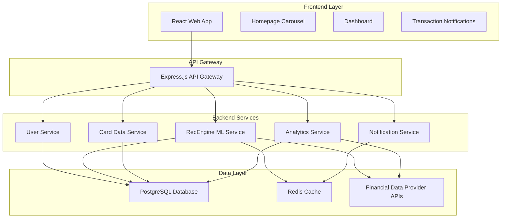
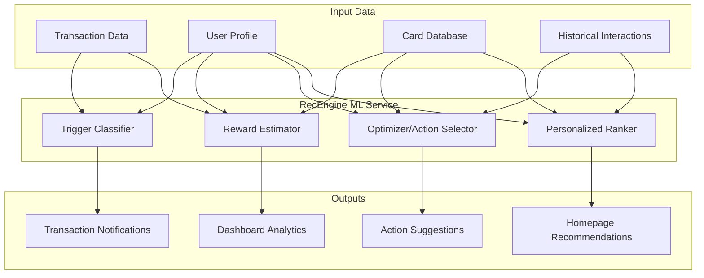

# Design Document

## Overview

The Credit Card Recommendation System is a full-stack web application designed for individual consumers to provide personalized credit card recommendations through intelligent analysis of user spending patterns. The system targets consumers who actively use credit cards and want to maximize their financial benefits through strategic card selection and usage optimization. The system consists of a React-based frontend, Node.js/Express backend, and integrates with the RecEngine ML service and financial data providers to deliver real-time insights and optimization suggestions.

The architecture follows a microservices-inspired approach with clear separation between user management, recommendation engine, financial data processing, and notification services. The system prioritizes security, scalability, and real-time performance to handle financial data processing and deliver timely recommendations.

## Architecture

### High-Level Architecture



### Technology Stack

**Frontend:**

- React 18 with TypeScript
- Material-UI for component library
- React Query for API state management
- Chart.js for data visualizations
- React Router for navigation

**Backend:**

- Node.js with Express.js
- TypeScript for type safety
- JWT for authentication
- Bcrypt for password hashing
- Node-cron for scheduled tasks

**Database:**

- PostgreSQL for primary data storage
- Redis for caching and session management
- Database migrations with Knex.js

**External Integrations:**

- Plaid API for financial data aggregation
- SendGrid for email notifications
- RecEngine ML Service for intelligent recommendations

### RecEngine ML Service Architecture

The recommendation system uses **RecEngine**, a sophisticated ML service that combines multiple specialized models to deliver intelligent, context-aware credit card recommendations. RecEngine provides a unified API that orchestrates four distinct ML models for different recommendation scenarios.

#### RecEngine Components



#### 1. Trigger Classifier

**Purpose:** Determines whether a transaction warrants a "which card to use" suggestion

**Model Type:** Binary Classification (Logistic Regression or Gradient Boosting)

**Input Features:**

- Transaction amount and category
- User's current card portfolio
- Historical spending patterns
- Time of transaction (seasonal patterns)
- Merchant type and location

**Output:**

- `recommend_flag` (0/1): Whether to show recommendation
- `extra_reward`: Potential additional reward amount
- `confidence_score`: Model confidence in the prediction

**Training Data:** Kaggle Credit Card Transactions Dataset + synthetic user interaction data

#### 2. Reward Estimator

**Purpose:** Calculates potential annual reward increase from card optimization

**Model Type:** Regression model or hybrid rule-based calculation

**Input Features:**

- User's annual spending by category
- Current card reward rates
- Candidate card reward structures
- Annual fees and terms

**Output:**

- `Δreward_per_year`: Projected annual reward increase
- `payback_period`: Time to recover annual fee
- `category_breakdown`: Reward increase by spending category

**Calculation Logic:**

```python
def estimate_reward_delta(user_spending, current_cards, candidate_card):
    current_rewards = calculate_current_rewards(user_spending, current_cards)
    optimized_rewards = calculate_optimized_rewards(user_spending, candidate_card)
    return optimized_rewards - current_rewards - candidate_card.annual_fee
```

#### 3. Optimizer/Action Selector

**Purpose:** Provides strategic card portfolio recommendations ("add new" vs "replace existing")

**Model Type:** Ranking Model (LightGBM Ranker or Pairwise Ranking)

**Input Features:**

- User's complete card portfolio
- Spending distribution across categories
- Card utilization patterns
- Credit profile indicators
- Market card offerings

**Output:**

- Ranked list of card recommendations
- Action type: `ADD_NEW`, `REPLACE_EXISTING`, `UPGRADE_CURRENT`
- Justification for each recommendation
- Portfolio optimization score

#### 4. Personalized Ranker

**Purpose:** Orders top N cards for homepage display based on individual preferences

**Model Type:** Collaborative Filtering + Learning-to-Rank (CF + LTR)

**Input Features:**

- User demographic and behavioral features
- Similar user preferences (collaborative filtering)
- Card features and market positioning
- Seasonal and trending factors
- User interaction history

**Output:**

- Top N ranked cards with personalization scores
- Diversity-adjusted rankings
- Contextual messaging for each recommendation

### RecEngine API Integration

#### Service Interface

```typescript
interface RecEngineService {
  // Trigger classification for transactions
  POST /recengine/trigger-classify
  body: {
    transaction: Transaction,
    userProfile: UserProfile,
    currentCards: CreditCard[]
  }
  response: {
    recommend_flag: boolean,
    extra_reward: number,
    confidence_score: number
  }

  // Reward estimation
  POST /recengine/estimate-rewards
  body: {
    userSpending: SpendingPattern,
    currentCards: CreditCard[],
    candidateCards: CreditCard[]
  }
  response: {
    reward_deltas: RewardEstimate[],
    category_breakdown: CategoryRewards
  }

  // Portfolio optimization
  POST /recengine/optimize-portfolio
  body: {
    userProfile: UserProfile,
    currentPortfolio: CreditCard[],
    preferences: UserPreferences
  }
  response: {
    recommendations: OptimizationRecommendation[],
    action_type: ActionType,
    portfolio_score: number
  }

  // Homepage personalization
  POST /recengine/personalized-ranking
  body: {
    userProfile: UserProfile,
    candidateCards: CreditCard[],
    contextualFactors: ContextualData
  }
  response: {
    ranked_cards: PersonalizedRecommendation[],
    diversity_score: number
  }
}
```

### Model Training and Data Pipeline

#### Training Data Sources

- **Primary:** Kaggle Credit Card Transactions Dataset
- **Synthetic:** Generated user interaction patterns
- **Market Data:** Current credit card offerings and terms
- **User Feedback:** Click-through rates and application data

#### Feature Engineering

- **Transaction Features:** Amount, category, frequency, seasonality
- **User Features:** Demographics, spending patterns, card preferences
- **Card Features:** Reward rates, fees, benefits, issuer characteristics
- **Interaction Features:** Historical clicks, applications, dismissals

#### Model Performance Monitoring

- **A/B Testing:** Compare model versions against baseline
- **Recommendation Quality:** Click-through rates, conversion rates
- **Business Metrics:** User engagement, revenue per recommendation
- **Model Drift Detection:** Monitor feature distributions and prediction quality

## Components and Interfaces

### Frontend Components

#### Homepage Recommendation Carousel

- **Purpose:** Display personalized card recommendations on the main page
- **Props:** `recommendations: CardRecommendation[]`, `onCardClick: (cardId: string) => void`
- **State:** Loading states, carousel position, user interaction tracking
- **Key Features:** Auto-rotation, responsive design, contextual messaging

#### Transaction Notification Component

- **Purpose:** Show real-time transaction-based card suggestions
- **Props:** `notification: TransactionNotification`, `onDismiss: () => void`, `onLearnMore: (cardId: string) => void`
- **State:** Visibility, animation states, user preferences
- **Key Features:** Toast-style notifications, dismissal tracking, monetary benefit highlighting

#### Dashboard Analytics Component

- **Purpose:** Comprehensive card performance and optimization insights
- **Props:** `userCards: UserCard[]`, `analytics: CardAnalytics`, `recommendations: OptimizationRecommendation[]`
- **State:** Selected time periods, chart configurations, comparison modes
- **Key Features:** Interactive charts, card comparisons, upgrade suggestions

### Backend Service Interfaces

#### User Service API

```typescript
interface UserService {
  // Authentication
  POST /api/auth/register
  POST /api/auth/login
  POST /api/auth/logout
  GET /api/auth/profile
  PUT /api/auth/profile

  // User preferences
  GET /api/users/preferences
  PUT /api/users/preferences
  POST /api/users/cards
  DELETE /api/users/cards/:cardId
}
```

#### Recommendation Engine API

```typescript
interface RecommendationService {
  // Homepage recommendations
  GET /api/recommendations/homepage

  // Transaction-based suggestions
  POST /api/recommendations/transaction-analysis

  // Dashboard optimization
  GET /api/recommendations/optimization

  // Preference-based filtering
  POST /api/recommendations/filtered
}
```

#### Card Data Service API

```typescript
interface CardDataService {
  // Card information
  GET /api/cards
  GET /api/cards/:cardId
  GET /api/cards/search

  // Admin endpoints
  POST /api/admin/cards
  PUT /api/admin/cards/:cardId
  DELETE /api/admin/cards/:cardId
}
```

#### Analytics Service API

```typescript
interface AnalyticsService {
  // User analytics
  GET /api/analytics/spending-patterns
  GET /api/analytics/card-performance
  GET /api/analytics/missed-rewards

  // System analytics
  GET /api/admin/analytics/recommendations
  GET /api/admin/analytics/user-engagement
}
```

## Data Models

### Core Data Models

#### User Model

```typescript
interface User {
  id: string;
  email: string;
  passwordHash: string;
  firstName: string;
  lastName: string;
  preferences: UserPreferences;
  createdAt: Date;
  updatedAt: Date;
}

interface UserPreferences {
  cardTypes: CardType[];
  maxAnnualFee: number;
  excludedCards: string[];
  notificationSettings: NotificationSettings;
}
```

#### Card Model

```typescript
interface CreditCard {
  id: string;
  name: string;
  issuer: string;
  cardType: CardType;
  annualFee: number;
  rewardStructure: RewardStructure[];
  benefits: string[];
  requirements: CardRequirements;
  isActive: boolean;
  createdAt: Date;
  updatedAt: Date;
}

interface RewardStructure {
  category: SpendingCategory;
  rewardRate: number;
  rewardType: "cashback" | "points" | "miles";
  cap?: number;
  conditions?: string;
}
```

#### Transaction Model

```typescript
interface Transaction {
  id: string;
  userId: string;
  amount: number;
  category: SpendingCategory;
  merchant: string;
  date: Date;
  cardUsed?: string;
  plaidTransactionId?: string;
}

enum SpendingCategory {
  GROCERIES = "groceries",
  DINING = "dining",
  TRAVEL = "travel",
  GAS = "gas",
  SHOPPING = "shopping",
  UTILITIES = "utilities",
  OTHER = "other",
}
```

#### Recommendation Model

```typescript
interface CardRecommendation {
  id: string;
  userId: string;
  cardId: string;
  recommendationType: "homepage" | "transaction" | "optimization";
  score: number;
  reasoning: string;
  projectedBenefit: number;
  context?: TransactionContext;
  createdAt: Date;
}

interface TransactionContext {
  transactionId: string;
  missedRewards: number;
  betterCardId: string;
  comparisonDetails: string;
}
```

### Database Schema Design

#### Key Tables

- `users` - User accounts and authentication
- `user_preferences` - User settings and preferences
- `credit_cards` - Card database with reward structures
- `user_cards` - User's current card portfolio
- `transactions` - Spending history and categorization
- `recommendations` - Generated recommendations and tracking
- `notification_history` - Sent notifications and user responses
- `analytics_cache` - Cached analytics calculations

#### Relationships

- Users have many UserCards (current portfolio)
- Users have many Transactions (spending history)
- Users have many Recommendations (personalized suggestions)
- CreditCards have many RewardStructures (earning rates)
- Transactions belong to SpendingCategories (for analysis)

## Error Handling

### Frontend Error Handling

- **Network Errors:** Retry logic with exponential backoff
- **Authentication Errors:** Automatic redirect to login with session restoration
- **Data Loading Errors:** Graceful fallbacks with user-friendly messages
- **Form Validation:** Real-time validation with clear error messaging

### Backend Error Handling

- **API Errors:** Structured error responses with error codes and messages
- **Database Errors:** Connection pooling with automatic retry and failover
- **External API Errors:** Circuit breaker pattern for financial data provider failures
- **Authentication Errors:** Secure error responses that don't leak sensitive information

### Error Response Format

```typescript
interface ApiError {
  error: {
    code: string;
    message: string;
    details?: any;
    timestamp: string;
    requestId: string;
  };
}
```

### Critical Error Scenarios

1. **Financial Data Provider Outage:** Fallback to cached data with staleness indicators
2. **Database Connection Loss:** Graceful degradation with read-only mode
3. **Recommendation Engine Failure:** Default to popular cards with generic messaging
4. **Authentication Service Issues:** Temporary guest mode with limited functionality

## Testing Strategy

### Frontend Testing

- **Unit Tests:** Jest and React Testing Library for component logic
- **Integration Tests:** API integration testing with mock backends
- **E2E Tests:** Cypress for critical user journeys (login, recommendations, dashboard)
- **Visual Regression Tests:** Chromatic for UI consistency
- **Performance Tests:** Lighthouse CI for page load and interaction metrics

### Backend Testing

- **Unit Tests:** Jest for service logic and utility functions
- **Integration Tests:** Supertest for API endpoint testing
- **Database Tests:** Test database with transaction rollback for isolation
- **Load Tests:** Artillery for API performance under load
- **Security Tests:** OWASP ZAP for vulnerability scanning

### Test Data Management

- **Mock Financial Data:** Realistic transaction patterns for testing recommendations
- **Card Database Fixtures:** Comprehensive card data for algorithm testing
- **User Scenarios:** Multiple user personas with different spending patterns
- **Edge Cases:** Boundary conditions and error scenarios

### Continuous Integration

- **Pre-commit Hooks:** Linting, type checking, and unit tests
- **Pull Request Checks:** Full test suite, security scans, and code coverage
- **Staging Deployment:** Automated deployment with smoke tests
- **Production Monitoring:** Real-time error tracking and performance monitoring

### Testing Environments

- **Development:** Local testing with Docker containers
- **Staging:** Production-like environment with sanitized data
- **Production:** Monitoring and alerting with minimal testing impact

## Security Considerations

### Data Protection

- **Encryption at Rest:** AES-256 encryption for sensitive financial data
- **Encryption in Transit:** TLS 1.3 for all API communications
- **PCI DSS Compliance:** Secure handling of payment card information
- **Data Minimization:** Store only necessary financial data with automatic purging

### Authentication & Authorization

- **JWT Tokens:** Short-lived access tokens with refresh token rotation
- **Password Security:** Bcrypt hashing with salt rounds
- **Session Management:** Secure session storage with automatic expiration
- **Role-Based Access:** Admin vs. user permissions with proper authorization checks

### API Security

- **Rate Limiting:** Prevent abuse with per-user and per-IP limits
- **Input Validation:** Comprehensive validation and sanitization
- **CORS Configuration:** Strict origin policies for browser security
- **Security Headers:** HSTS, CSP, and other protective headers

### Financial Data Integration

- **OAuth 2.0:** Secure authorization flow with financial data providers
- **Token Management:** Secure storage and rotation of API tokens
- **Data Scope Limitation:** Request minimal necessary permissions
- **Audit Logging:** Comprehensive logs for financial data access and usage
